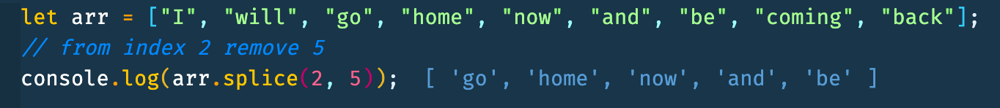
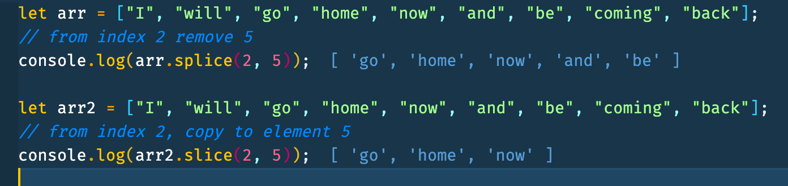

# Add or Remove Elements in JavaScript

## Add/Remove Items

- arr.push(...items) - adds items to the end
- arr.pop() - removes items end
- arr.shift() - removes items form beginning
- arr.unshift(...items) - adds items to beginning

### Push - Adding items to the end of arrays

```js
const movies = ["The Matrix", "The Departed", "The Batman", "The Fighter"];
movies.push("The League of Extraordinary Gentlemen");
console.log(movies);
```


### Pop - Remove items from the end of arrays

```js
const movies = ["The Matrix", "The Departed", "The Batman", "The Fighter"];
movies.pop();
console.log(movies);
```


### Shift - Remove an item from the beginning

```js
const movies = ["The Matrix", "The Departed", "The Batman", "The Fighter"];
movies.shift();
console.log(movies);
```


### Shift - Add item to beginning of array

```js
const movies = ["The Matrix", "The Departed", "The Batman", "The Fighter"];
movies.unshift("The Prestige");
console.log(movies);
```


Reversing A String

```JavaScript
let unoReverse = (str) => str.split("").reverse("").join("");
// str.split("")
console.log(unoReverse("currahee"));
console.log(unoReverse("racecar"))
```

### Splice - at index pos deletes deleteCount elements and insert items

```JavaScript
splice(pos, deleteCount, ...items)
```

```JavaScript
let arr = ["I", "will", "go", "home", "now", "and", "be", "coming", "back"];
arr.splice(1, 2); // from index 1, remove 4 elements
console.log(arr);
```



### Slice - creates a new array, copies elements from index start till end (not inclusive into it)

```JavaScript
let arr = ["I", "will", "go", "home", "now", "and", "be", "coming", "back"];
console.log(arr.slice(2, 5)); /// "go, "home", "now" - (copy from 2 to 5)

let arr2 = ["t", "e", "s", "t"];
console.log(arr2.slice(1, 3)); /// "e" and "s" - (copy from 1 to 3)
```

Array Slice and Splice Difference

