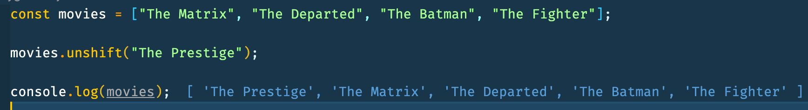

# JavaScript Arrays Basics

## Push - Adding items to the end of arrays

```js
const movies = ["The Matrix", "The Departed", "The Batman", "The Fighter"];
movies.push("The League of Extraordinary Gentlemen");
console.log(movies);
```


## Pop - Removing items from the end of arrays

```js
const movies = ["The Matrix", "The Departed", "The Batman", "The Fighter"];
movies.pop();
console.log(movies);
```


## Shift - Extracts an item from the beginning

```js
const movies = ["The Matrix", "The Departed", "The Batman", "The Fighter"];
movies.shift();
console.log(movies);
```


## Shift - Add item to beginning of array

```js
const movies = ["The Matrix", "The Departed", "The Batman", "The Fighter"];
movies.unshift("The Prestige");
console.log(movies);
```


