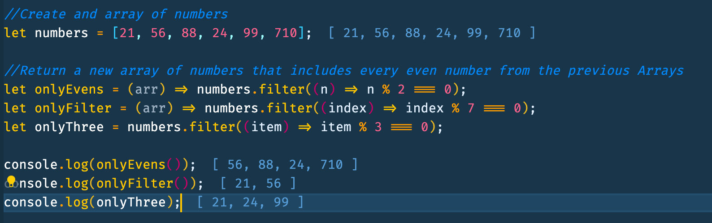

# JavaScript Find/Filter

- find/filter(func) - filters elements through the function, returns first/all values that make it return true.
- Filter returns an array of all matching elements

```JavaScript
let results = arr.filter(function(item, index, array) {
  // if true item is pushed to results and the iteration continues
  // returns empty array if nothing found
});
```

```JavaScript
//Return a new array of numbers that includes every even number from the previous Arrays
let numbers = [21, 56, 88, 24, 99, 710];
let onlyEvens = (arr) => numbers.filter((n) => n % 2 === 0);
let onlyFilter = (arr) => numbers.filter((index) => index % 7 === 0);
let onlyThree = numbers.filter((item) => item % 3 === 0);

console.log(onlyEvens());
console.log(onlyFilter());
console.log(onlyThree);

```


