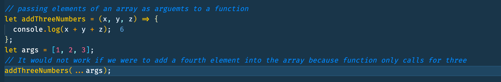
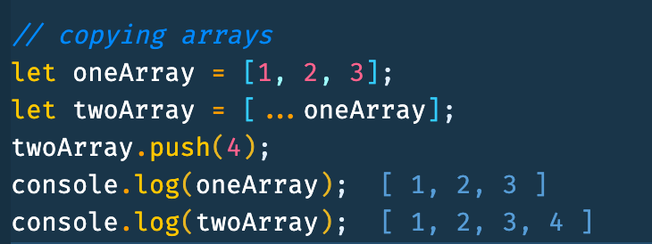
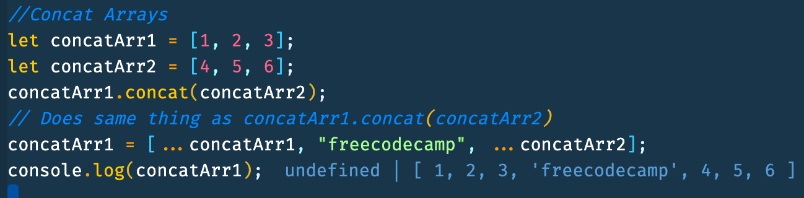

## Spread Operator

Spread syntax (...) allows an iterable such as an array expression or string to be expanded in places where zero or more arguments (for function calls) or elements (for array literals) are expected, or an object expression to be expanded in places where zero or more key-value pairs (for object literals) are expected.

Adding elements of an existing array into an new array

```JavaScript
let certsToAdd = ["Algorithms and Data Strucures", "Front End Libraries"];
let certifications = [
  "Responsive Web Dev",
  ...certsToAdd,
  "Data Visualization",
];
console.log(certifications);
```



Passing Elements of an array as arguments to a function

```JavaScript
let addThreeNumbers = (x, y, z) => {
  console.log(x + y + z);
};
let args = [1, 2, 3];
// It would not work if we were to add a fourth element into the array because function only calls for three
addThreeNumbers(...args);
```


Coyping Arrays

```JavaScript
let oneArray = [1, 2, 3];
let twoArray = [...oneArray];
twoArray.push(4);
console.log(oneArray);
console.log(twoArray);
```



Concat Arrays

```JavaScript
let concatArr1 = [1, 2, 3];
let concatArr2 = [4, 5, 6];
concatArr1.concat(concatArr2);
// Does same thing as concatArr1.concat(concatArr2)
concatArr1 = [...concatArr1, "freecodecamp", ...concatArr2];
console.log(concatArr1);
```


