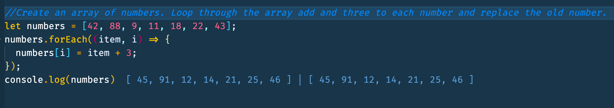

# forEach in JavaScript

- forEach() - to iterate over elements. forEach calls `func` for every element, does not return anything

```js
let numbers = [42, 88, 9, 11, 18, 22, 43];
numbers.forEach((item, i) => {
  numbers[i] = item + 3;
});
```


